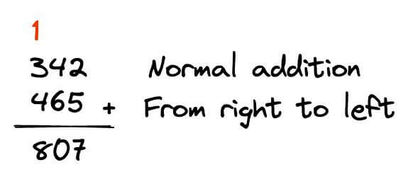
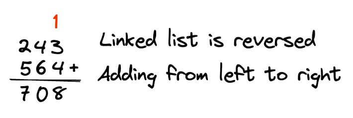

In this post, we'll be solving "Add Two Numbers" from LeetCode.

The title sounds so simple but it's actually much more challenging then it sounds because we're dealing with linked list.

> A linked list is a sequence of nodes that contain two fields: an integer value and a link to the next node.


Now, let's go and solve the problem!

## Problem

You are given two non-empty linked lists representing two non-negative integers. The digits are stored in reverse order, and each of their nodes contains a single digit. Add the two numbers and return the sum as a linked list.

You may assume the two numbers do not contain any leading zero, except the number 0 itself.

Example 1:

```
Input: l1 = [2,4,3], l2 = [5,6,4]
Output: [7,0,8]
Explanation: 342 + 465 = 807.
```

Example 2:

```
Input: l1 = [0], l2 = [0]
Output: [0]
```

Example 3:

```
Input: l1 = [9,9,9,9,9,9,9], l2 = [9,9,9,9]
Output: [8,9,9,9,0,0,0,1]
```

Constraints:

- The number of nodes in each linked list is in the range `[1, 100]`.
- `0 <= Node.val <= 9`
- It is guaranteed that the list represents a number that does not have leading zeros.

## Solution

### Analysis

This is a simple addition problem.



But in the linked list version, the numbers are sorted in reverse. That means we have to do our addition in reverse too.



### Approach

1. Create a dummy list node that'll point to our answer (This value should never change).
2. Create a cursor that'll manage our answer's linked list.
3. Traverse both list, but when the list is `null`, we replace the value with `0`. Just like in real world addition (no number is equal to 0).
4. When traversing through the list, we add the number normally while also keeping track of the `carry`.
5. After the addition is performed, have our cursor point to the addition result.
6. Repeat until both list are traversed (both list are `null`).
7. There might be an extra carry after the last addition, Let's not forget to handle that!
8. Finally, return what our dummy list node from step 1 is pointing to.

### Code

First, let's look at how our linked list is representated:

```ts
class ListNode {
  val: number
  next: ListNode | null
  constructor(val?: number, next?: ListNode | null) {
    this.val = (val===undefined ? 0 : val)
    this.next = (next===undefined ? null : next)
}
```

Now, for the solution:

```ts
function addTwoNumbers(l1: ListNode | null, l2: ListNode | null): ListNode | null {
	const answerHead = new ListNode();
	let cursor = answerHead;
	let carry = 0;

	while (l1 !== null || l2 !== null) {
		const x = l1 ? l1.val : 0;
		const y = l2 ? l2.val : 0;
		const sum = x + y + carry;
		carry = sum >= 10 ? 1 : 0;
		cursor.next = new ListNode(sum % 10);
		cursor = cursor.next;

		if (l1 != null) l1 = l1.next;
		if (l2 != null) l2 = l2.next;
	}

	if (carry > 0) {
		cursor.next = new ListNode(carry);
	}

	return answerHead.next;
}
```

### Time Complexity

The time complexity is `O(Max(m, n))` because both of the list will only be traversed once, and the complexity depends on which list is longer.

### Space Complexity

The space complexity is `O(1)` because we're using space only for our variables.

## Wrap Up

That's it for LeetCode's "Add Two Numbers" 🎉.

You can also find the code on my [Github](https://github.com/tanerijun/ts-leetcode).
