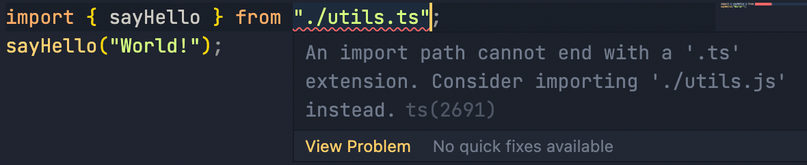
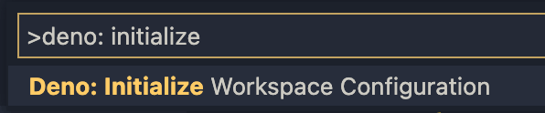

When we are working with Deno, we often need to import files with .ts extension. But the built-in TS language server from VSCode is usually unhappy when we do this.



_An import path cannot end with a '.ts' extension._

To solve this issue, we need to install the [official Deno extension for VSCode](https://marketplace.visualstudio.com/items?itemName=denoland.vscode-deno). This extension is the language server client for Deno.

After installing the extension, simply open up your command palette (`ctrl` + `shift` + `p`), and type `deno: initialize`.



This will create a `.vscode` folder in your workspace with a file called `settings.json` inside. The file will look something like this:

```json
{
	"deno.enable": true,
	"deno.lint": true
}
```

The `deno.enable` option will enable the Deno language server and disable the built-in VSCode JavaScript and TypeScript language services.

The `deno.lint` option will enable the deno linter. This option is optional.

With that, you should now be able to import a .ts file without any problem.

It's also possible to enable the extension globally if you look for `Deno: Enable` in your VSCode's user setting. But it's not recommended because enabling the Deno language server will disable the built in TS language server. Except if you're sure you'll only be using Deno from now on 😆.
