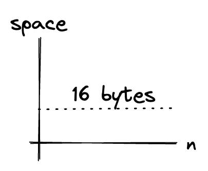
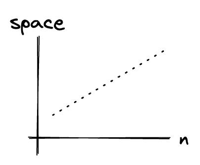
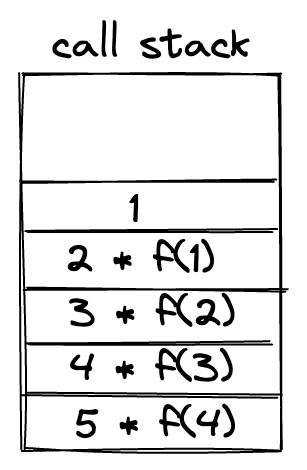

If you're like me, you'll find space complexity much more tricky to calculate than the time complexity. It always seems to go over your head.

In this post, we'll learn about space complexity by looking at several examples. We'll also learn that there are 2 ways to look at space complexity.

## Table Of Contents

## What Is Space Complexity?

Space complexity refers to how much memory required by an algorithm grows with respect to the size of the input given to the algorithm.

For example, if we have a function `doSomething(n)`. Space complexity refers to how much space `doSomething(n)` will occupy in memory based on the size of `n`.

Just like time complexity, space complexity is often expressed with the big O notation, such as `O(1)`, `O(n)`, `O(n log(n)`, etc.

Before we dive into the examples, there's another concept that we need to understand, and that is **auxiliary space**.

Auxiliary space is the extra space used by an algorithm (excluding the input).

When it comes to calculating space complexity as a whole, we need to include both auxiliary space and the space used by the input.

Space complexity = Auxiliary Space + Space taken by input values.

However, sometimes we don't consider this as the actual measure of space complexity. Sometimes we only consider the auxiliary space.

For example, if we want to compare standard sorting algorithms on the based on space, then auxiliary space would be a better criterion than space complexity. Merge Sort uses `O(n)` auxiliary space, Insertion sort, and Heap Sort use `O(1)` auxiliary space. The space complexity of all these sorting algorithms is `O(n)` though.

_More about this on example 3 later._

## Examples

Let's dive into some examples to finally make sense of space complexity!

### Example 1

Let's start by taking a look at this simple algorithm that adds two numbers.

```java
int addTwoNumbers(int n1, int n2) {
  int sum = n1 + n2;
  return sum;
}
```

Let's try estimating the size that'll be used by the function!

Assuming that an integer take 4 bytes, and the auxiliary space is also 4 bytes.

_The auxiliary space here refers too stuff like the function call, the return call, how to do a loop, etc. (Basically the computer instructions)._

To the calculation:

`space complexity = sizeof n1 + sizeof n2 + sizeof sum + auxiliary space = 16 bytes.`

For this kind of algorithm, no matter what the values of `n1` and `n2` are, the space needed is always the same. Everything inside the algorithm is of a fixed size. This is also called **constant** space complexity or `O(1)`.



### Example 2

Let's take a look at another example!

This is an algorithm to sum all the numbers in an array.

```java
int sumNumbersInArray(int[] arr) {
  int sum = 0;

  for (int i = 0; i < arr.length; i++) {
    sum += arr[i];
  }

  return sum;
}
```

Unlike the first example, this time the size of arr is dynamic. Let's call it `n`.

Assuming that the size of an integer is 4 bytes, and the auxiliary space is also 4 bytes. The total space needed is:

`space complexity = sizeof arr + sizeof sum + sizeof i + auxiliary space = 4n + 12 bytes`

or

`space complexity = O(4n + 12 bytes)`

> Remember that constants are ignored in Big O Notation.

So the space complexity is `O(n)`, also called **linear** space complexity.



### Example 3

Earlier I mentioned that sometimes we only consider the auxiliary space when calculating space complexity.

This example will make it clear why we do that.

In this example, we'll look at 2 versions of an algorithm to count the [factorial](https://en.wikipedia.org/wiki/Factorial) of a number. One is iterative, while the other one is recursive.

Let's start with the iterative version:

```java
int factorial(int n) {
  int result = 1;

  for (int i = 1; i <= n; i++) {
    result = result * i
  }

  return result;
}
```

Assuming that the size of an integer is 4 bytes and the auxiliary space is 4 bytes. The space complexity for this algorithm is:

`space complexity = sizeof n + sizeof result + sizeof i + auxiliary space = 16 bytes`

Removing the constants, our space complexity is contant (`O(1)`).

No matter what `n` we pass to the function, no matter how many times the loop run, the space complexity will be the same (there's just one variable `i`).

Now, let's look at the recursive version!

```java
int factorial(n) {

  if (n <= 1) {
    return 1;
  }

  return n * factorial(n - 1);
}
```

This time, we're down to only 1 variable (`n`). But the auxiliary space needed is not as simple anymore.

Let's look at the call stack assuming `n = 5`.



As the value of `n` increases, the number of function call also increase. Each function call has each own auxiliary space. So the auxiliary space will be based on `n`.

Going back to the algorithm, the space complexity for the algorithm is:

`space complexity = sizeof n + (n * auxiliary space)`

Remove the constants, and we get:

`space complexity = O(n)`

In a recursive algorithm like this, auxiliary space is no longer just a constant. It is the focus of the calculation instead.

This is why merge sort's space complexity is `O(n)` while insertion sort's space complexity is only `O(1)`.

## Wrap Up

That's it for space complexity 🎉.

I hope this article give you a better understanding of space complexity, especially when deciding whether or not you have to factor in the auxiliary space into the calculation.
